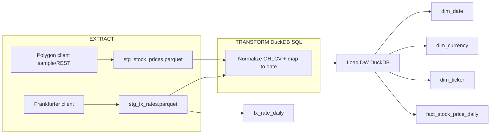
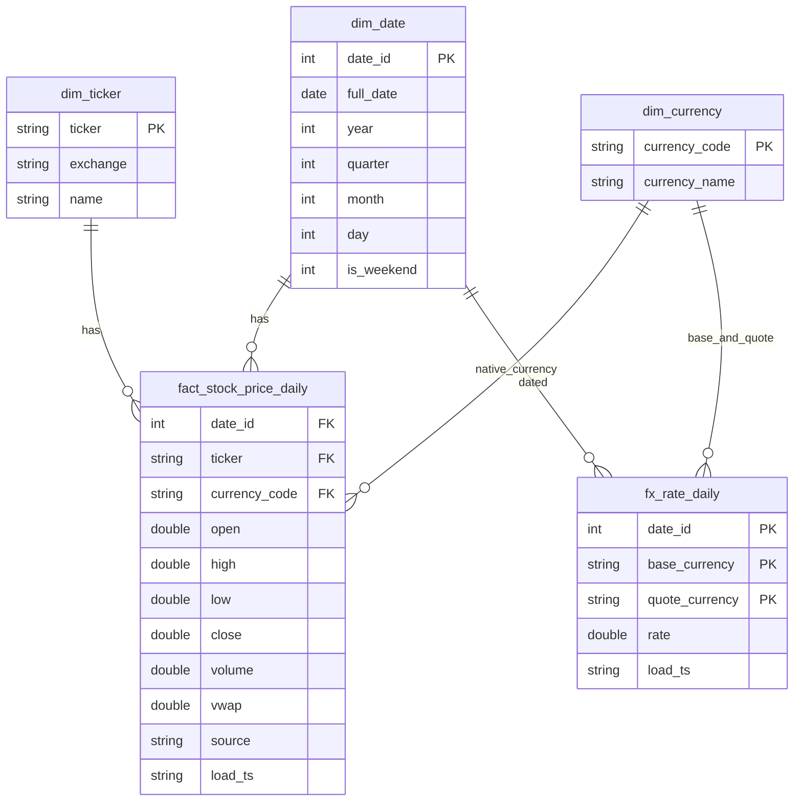

# Section 1: API Integration and Data Pipeline

To Pandas or not to Pandas?

---

## Options & Trade-offs

### Storage

**[DuckDB](https://duckdb.org/docs/stable/data/parquet/overview.html) + Parquet** for simplicity, reproducibility, and local performance while keeping SQL semantics portable.

- **Why better now**: zero infra, SQL performance on `Parquet`, ideal for local, easy to ship.
- **Future**: replace `DuckDB` DDL with `Redshift/BigQuery` via `dbt` models.
- **Alternatives**:
  - `Redshift/BigQuery`: Managed scale & IAM integration, but setup/cost/time > this assignment.
  - `Pandas`: Convenient but memory bound, no pushdown/pruning.
  - `Spark`: Scales out, but overkill for the assignment.

### Transformation Engine

**DuckDB SQL over staged Parquet**

- **Why better**: vectorized SQL, join/pushdown, easy incremental merge patterns and I'm already using DuckDB for storage.
- **Alternatives**:
  - `Spark`: Great at huge scale, too heavy here.
  - `Pandas`: OK for small data, but less efficient on joins and partitions.
  - `Polars`: Probably ideal for the assignment but adds additional dependency so not choosen.

### Conversion Strategy

**On-the-fly cross-rates at query time**

- **Why better**: avoids N×C precompute, exact-rate for requested date using `EUR` (or chosen base) cross-rates from Frankfurter.
- **Alternatives**:
  - Precompute all currencies: too costly.
  - Hybrid: cache a few popular target currencies (USD/EUR/ILS) in materialized views.

### Polygon Integration

**Sample mode** (assignment requirement).  
`REST` requires API key. The client has an `env`-toggle to switch to real API via [official Python client](https://github.com/polygon-io/client-python) or `requests`.

### Orchestration

**Airflow DAG**: retry/backoff, scheduling, observability, idempotent ETL.

---

## Architecture (ETL & DW)



---

## ERD



## Data modeling approach

- **Dimensional model**: `dim_date`, `dim_currency`, `dim_ticker`, `fact_stock_price_daily`, `fx_rate_daily`.
- **Reasoning**: Stable dimensions + narrow fact → efficient queries and easy joins.
- **Currency conversion**: Any stock can be converted to any currency by cross-joining `fx_rate_daily` with `fact_stock_price_daily` using the canonical base (EUR).

## How this enables Currency-Converted stock analysis

- Store stocks only in their native currency.
- **On query**: convert to any other currency using the formula:
  - converted_price = native_price \* rate(EUR→target) / rate(EUR→native)
- This avoids data explosion and guarantees exact historical conversions.
- **Optionally**: cache hot currencies (USD/EUR/ILS) as materialized views for faster BI.

## Configuring for Different Stocks or Currencies

- Change the ticker parameter in the pipeline run (AAPL, MSFT, etc.).
- Change the base currency in the FX extractor (EUR, USD, etc.).
- Airflow DAG parameters can support multiple tickers in parallel (task mapping).
- Currency list is fetched dynamically from Frankfurter, so adding new currencies requires no schema changes.

## Handling Potential Issues

- **Polygon REST API failures**: retries with exponential backoff, clear error if API key missing/invalid.
- **Frankfurter downtime or late data**: retries, schedule pipeline after 18:00 CET to ensure rates are published.
- **Missing data**: enforce integrity via dbt/SQL checks (high >= low, positive volume, FX rate > 0).
- **Idempotency**: delete-and-insert for overlapping windows; can be upgraded to SQL MERGE in production.

## Scheduling, OPS & Monitoring in Production & Observability

- **Scheduler**: Apache Airflow with `@daily` DAGs.
- **Observability**: JSON logs, retries, Airflow task retries + SLA monitoring.
- **Data quality monitoring**: `dbt` or `Great Expectations` checks at stage/fact level.
- **Alerting**: integration with `AWS SNS` or similar for Slack/Email/Teams alerts if pipeline/task fails/misses SLA.
- **Recovery**: Re-run missed intervals `(catchup=True)` for deterministic backfills.
- Retries/backoff on both clients via `tenacity` (HTTP transient resilience).
- Structured logs JSON to stdout (python-json-logger), scraped by Airflow.
- **Airflow**:
  - @daily schedule, deterministic logical dates, catchup for backfills.
  - Airflow XCom discipline: pass only paths/IDs, not dataframes.
- **Failure modes**:
  - Polygon REST key missing/invalid → fail fast with clear error, sample mode still works.
  - Frankfurter latency/outage → retried, for today’s date, FX may shift until ~16:00 CET, schedule DAG after 18:00 CET to be safe.
- **DR/Portability**:
  - Parquet files are portable; `sql/dw_schema_duckdb.sql` can be converted to `dbt` models targeting `Redshift`/`BigQuery` (`MERGE` for `fact/FX`).

## Running

If using sample data, make sure to put the `.json` sample to `/data/sample/`

```bash
# env
cd section1
export APP_POLYGON_MODE=sample            # or: rest
export APP_POLYGON_API_KEY=YOUR_KEY       # required if APP_POLYGON_MODE=rest

# install
pip install poetry && poetry install

# run
python -m src.main  # defaults (AAPL, 30d window, EUR base)
```

This creates two `.parquet` files (`stg_stock_prices`, `stg_fx_rates`) and loads them into `DuckDB`.
