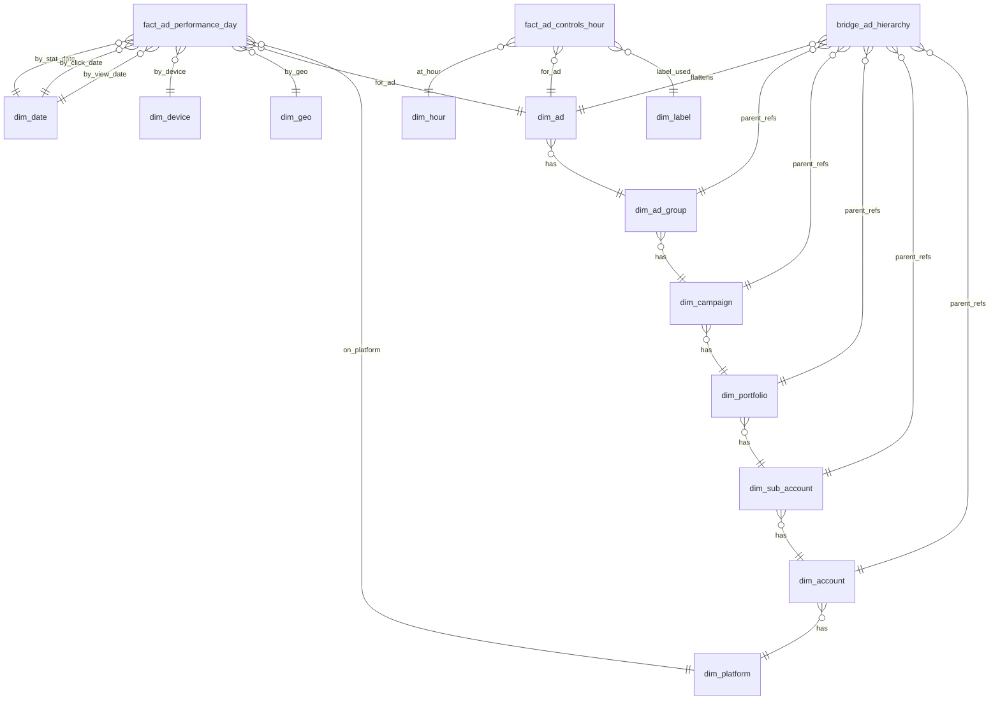

# Section 2: Marketing Data Modeling Challenge

## Options & Trade-offs

#### **Option A** - Pure snowflake schema (one dim per hierarchy level, fact at ad-day)

- **Pros**: clear lineage, high integrity, easy SCD2 per entity, intuitive joins.
- **Cons**: many joins for BI, slow if not clustered, frequent cross-level filters can be verbose.
- **When**: strong data governance & SCD2 required per level.

#### **Option B** - Wide denormalized ad dimension (flatten parents into dim_ad, star joins)

- **Pros**: fastest analytics (1–2 joins), simpler BI.
- **Cons**: parent changes force type-2 explosion in dim_ad, harder to reason about parent SCD2 independently.

#### **Option C** - Bridge + Stars (Hybrid): SCD2 dims per level plus a hierarchy bridge for fast rollups, star facts at daily & hourly grains

- **Pros**: integrity + flexibility, efficient rollups via bridge, keeps dim_ad stable while parents evolve, supports both `by-level` and `roll-up` queries.
- **Cons**: slightly more ETL logic, `n` extra tables.

#### **Option D** — Data Vault (Hubs/Satelites/Links) modeled from APIs + marts for BI

- **Pros**: change-resilient ingestion, easy source onboarding.
- **Cons**: overkill for the assignment, longer time-to-value.

#### **Decision Record**: Why C over A/B/D

- **C** retains **SCD2** integrity (like A), avoids over-denormalization churn (B), and avoids DV complexity (D). It scales to new platforms cleanly and supports both historical and up-to-date reporting. Might choose D - Full Data Vault Raw/Business (PIT/Bridge + derived rules) if I had more time to play with it.

---

## Chosen Design (Hybrid Star + Bridge)

### Logical Model

#### Facts

- fact_ad_performance_day — daily metrics (impressions, clicks, cost) at Ad × stat_date × device × geo; includes optional click_date_id / view_date_id for attribution analysis.
- fact_ad_controls_hour — hourly snapshot of bid & label at Ad × hour (for “what was the bid/label at time t?”).

#### Dimensions (SCD2 where names/metadata can change)

- dim_platform (SCD1)
- dim_date, dim_hour (calendar/time)
- dim_device (SCD1)
- dim_geo (SCD1, can be extended with geo hierarchy)
- dim_account, dim_sub_account, dim_portfolio, dim_campaign, dim_ad_group, dim_ad (SCD2)
- dim_label (mini-dimension; deduplicates free-text labels; referenced by hourly control snapshots)

#### Bridge

- bridge_ad_hierarchy — materialized path from each ad to all parents to support rollups with minimal joins.

## ERDs

---

### Key Modeling Decisions

- SCD2 on names/ownership for all hierarchy dim. Use (natural_key, effective_from, effective_to, is_current).
- Rapid changes (bid, label) captured in hourly snapshot fact rather than exploding SCD2 in dim_ad.
- Label stored in dim_label (mini-dim) to dedupe text and enable label-based filtering, the hourly fact references it for each hour.
- Nullable dates handled with surrogate `unknown` date keys in dim_date (0 rows for unknown). Ditto device/geo if needed.
- Conformed dims (dim_device, dim_geo) normalize platform idiosyncrasies.

#### Why hourly snapshot for bid/label over SCD2 mini-dim only?

- Snapshots preserve point-in-time values without forcing daily fact rebuilds and make "what was the bid at 10:00?" trivial. The mini-dim still reduces label storage.

---

## Implementation DDL

find DDL here: [section2\sql\schema_ddl.sql](https://github.com/TenebrisX/wix-de/blob/section2/section2/sql/schema_ddl.sql)

For prod use warehouse-native partitioning:

- **Redshift**: `DISTKEY(stat_date_id)` / `SORTKEY(stat_date_id, ad_id)`.
- **Postgres/Vertica**: declarative partitioning by `stat_date_id`.

Also recommend to seed "unknown" members to avoid null FKs, find see sql here [section2\sql\seed_unknowns.sql](https://github.com/TenebrisX/wix-de/blob/section2/section2/sql/seed_unknowns.sql)

---

## Loading & Update Strategy

### Daily performance (fact_ad_performance_day)

- Upsert by (platform_id, ad_id, stat_date_id, device_id, geo_id) using src_hash to detect changes.
- Map platform rows to surrogate keys via (platform_code, platform_native_id) lookups; insert SCD2 rows when names change.
- If click/view date is available, set click_date_id/view_date_id; otherwise 0 (unknown).
- **Late data**: re-run upsert for impacted date partitions; idempotent via src_hash.

### Hourly controls (fact_ad_controls_hour)

- At top of each hour (or streaming), snapshot bid and label for each active ad:
  - **Label**: lookup/create in dim_label (dedup).
  - Upsert on `(platform_id, ad_id, hour_id)` with new src_hash if changed.

### Bridge refresh

- **Rebuild** `bridge_ad_hierarchy` daily (or hourly if parents change often): latest SCD2 current rows only.

### Why hash-based idempotence over delete+insert?

- Hash allows cheap change detection and safe late arriving corrections without full rewrites in large partitions.

---

## Data Processing Considerations

### Hourly vs. Daily

- **Hourly**: `fact_ad_controls_hour` supports operational reporting ("bid trend by hour", "label adoption"), enabling up-to-date views.
- **Daily**: `fact_ad_performance_day` supports core KPIs over time, consistent with platform daily aggregates.

### Historical Changes

- SCD2 captures name/ownership evolution of hierarchy entities independently (no metric changes).
- **Point-in-time analyses**: join facts to the SCD2 row valid as of `stat_date_id` (or `hour_id`) using the surrogate FK already resolved at load time.

---

## Data Quality & Null Handling

- Not-null metrics enforced with check >= 0.
- Nullable dates resolved to 0 (Unknown) keys when missing.
- Device/Geo are non-null per problem, if platform sends "unknown", map to the 0 row to preserve integrity.
- **Deduplication**: unique keys on both facts enforce no double counting per grain.
- **Source conformance**: central mapping layer standardizes device & geo codes.

### Why "Unknown" surrogate over SQL NULL FK?

- Prevents join loss, keeps aggregates stable, and simplifies BI models (no conditional joins).

---

## Indexing & Partitioning

### fact_ad_performance_day:

- Partition by `stat_date_id`.
- Cluster/Sort by `(platform_id, ad_id)` and optionally `(device_id, geo_id)`.
- Additional search indexes for common filters: `(campaign_id via bridge)` in materialized views.

### fact_ad_controls_hour:

- Partition by `hour_id` // `n` day.
- Cluster/Sort by `(platform_id, ad_id)`.
- **Bridge**: index on all parent IDs for fast joins by any level.
