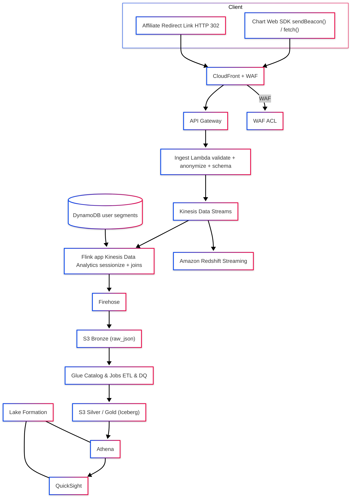

# Section 3: Architectural Design Challenge

## Options & Trade‑offs

### A. Kinesis-first Lakehouse (API Gateway → Lambda → Kinesis Data Streams → Firehose → S3/Iceberg; RT path via Redshift Streaming)

- **Pros**: Serverless scale, exactly‑once in consumers, mature AWS-native (one provider), shardable, RT via `Redshift` streaming ingestion, cheap `S3` store with `Iceberg`. Can be scaled up or down as needed.
- **Cons**: Shard management, Flink for advanced streaming joins adds complexity.

### B. Kafka + Connect Sinks → S3/Redshift

- **Pros**: Kafka ecosystem, flexibility for 3rd‑party connectors.
- **Cons**: Kafka Cluster ops cost & complexity > Kinesis? (by chat gpt, gemeni, and cloude, and some [forums](https://estuary.dev/blog/amazon-kinesis-vs-kafka/#:~:text=However%2C%20their%20underlying%20architectures%2C%20operational,like%20Confluent%20or%20Amazon%20MSK.), Kafka overall is more expansive than Kinesis. Could be wrong, maybe could work with Managed Kafka). Overkill for `events-in → lake + RT marts`.

### C. Direct Firehose ingest (HTTP → Lambda → Firehose → S3/Redshift)

- **Pros**: No stream ops, built-in Parquet conversion and buffering.
- **Cons**: Less control on fan-out and RT compute, no stateful streming, or hard to do.

### D. Simple Queue (AWS SQS) + Lambda fan-out

- **Pros**: Cheapest, simple, maybe good enough for the assignment.
- **Cons**: Lower throughput, no ordered partitions, limited RT analytics.

### Choosed Option A. It kinda balances scale, cost, and flexibility:

- Streams for durable fan‑out + Firehose for cheap batch landing + Redshift Streaming for sub‑minute marts.
- Firehose-only **(C)** is simpler but limits RT compute.
- Kafka/MSK **(B)** adds ops cost, SQS **(D)** sacrifices ordering/throughput.

---

## Design



### Component roles

- **CloudFront + WAF**: global edge endpoint, bot/DDoS filtering, TLS. WAF attaches at `CloudFront`. HTTP API isnt directly WAF‑attachable in all cases, so front it with `CloudFront`.

- **API Gateway (HTTP API)**: public ingest.

- **AWS Lambda (Ingest)**: trigger. schema validation, consent check, IP truncation, produce to Kinesis partitioned by session_id.

- **AWS Kinesis Data Streams**: durable, ordered partitions, scalable shards. Per-shard limits: **1 MB/s** or **1,000 records/s** writes. **2 MB/s** reads.

- **AWS Kinesis Data Analytics (Flink)**: real‑time & joins with reference data - (DynamoDB segments).

- **AWS Firehose**: buffers & converts `JSON` to `Parquet` to `S3` **Bronze**. Optional compression.

- **AWS Glue Jobs + Iceberg**: **Bronze** to **Silver** (normalized) to **Gold** (analytics) with `Apache Iceberg` tables in `AWS Glue Catalog`. Query via Athena.

- **AWS Redshift (Streaming Ingestion)**: materialized views over `Kinesis` for minute dashboards. possibly S3 staging.

- **AWS Lake Formation**: Centralized row/column security & governance.

- **QuickSight**: self‑service BI on `AWS Athena/Redshift` with **RLS** via `Lake Formation`.

---

## Data Schemas

### 1. Browser SDK → API Gateway (HTTP POST JSON) LLM generated example

```json
{
  "$id": "https://schemas.example.com/events/ingest.json",
  "$schema": "https://json-schema.org/draft/2025-08/schema",
  "title": "_event_ingest",
  "type": "object",
  "required": ["event_type", "ts", "user"],
  "properties": {
    "schema_version": {
      "type": "string",
      "pattern": "^1\\.\\d+\\.\\d+$",
      "default": "1.0.0"
    },
    "event_type": {
      "enum": ["page_view", "chart_interaction", "affiliate_click"]
    },
    "event_id": { "type": "string", "format": "uuid" },
    "ts": { "type": "string", "format": "date-time" },
    "user": {
      "type": "object",
      "required": ["consent"],
      "properties": {
        "user_id_hash": { "type": "string" },
        "consent": {
          "type": "object",
          "required": ["analytics"],
          "properties": {
            "analytics": { "type": "boolean" },
            "ads": { "type": "boolean" }
          }
        }
      }
    },
    "session": {
      "type": "object",
      "properties": {
        "session_id": { "type": "string" },
        "utm": {
          "type": "object",
          "properties": {
            "source": { "type": "string" },
            "medium": { "type": "string" },
            "campaign": { "type": "string" },
            "term": { "type": "string" },
            "content": { "type": "string" }
          }
        }
      }
    },
    "ctx": {
      "type": "object",
      "properties": {
        "page_url": { "type": "string" },
        "referrer": { "type": "string" },
        "locale": { "type": "string" },
        "user_agent": { "type": "string" },
        "ab_variant": { "type": "string" }
      }
    },
    "chart": {
      "type": "object",
      "properties": {
        "product_ids": { "type": "array", "items": { "type": "string" } },
        "action": {
          "enum": [
            "toggle",
            "sort",
            "filter",
            "compare_expand",
            "compare_collapse"
          ]
        },
        "control_id": { "type": "string" },
        "control_value": { "type": ["string", "number", "boolean", "null"] }
      }
    },
    "affiliate": {
      "type": "object",
      "properties": {
        "link_id": { "type": "string" },
        "target": { "type": "string" },
        "payout_cents": { "type": "integer", "minimum": 0 }
      }
    },
    "metadata": {
      "type": "object",
      "properties": {
        "sdk_version": { "type": "string" },
        "experiment_keys": { "type": "array", "items": { "type": "string" } }
      }
    }
  },
  "allOf": [
    {
      "if": {
        "properties": { "event_type": { "const": "chart_interaction" } }
      },
      "then": { "required": ["chart"] }
    },
    {
      "if": { "properties": { "event_type": { "const": "affiliate_click" } } },
      "then": { "required": ["affiliate"] }
    }
  ],
  "unevaluatedProperties": false
}
```

#### Validation in Lambda enforces the above + privacy checks. Lambda adds server enrichments.

### 2. API Gateway → Lambda → Kinesis (Producer Payload)

```json
{
  "schema_version": "1.1.0",
  "event_type": "chart_interaction",
  "event_id": "someid",
  "ts": "2025-08-20T20:20:20.123Z",
  "ingest_ts": 1755609845123,
  "source": "web",
  "privacy": {
    "analytics": true,
    "ads": false,
    "source_ip_anonymized": "..."
  },
  "user": { "user_id_hash": "sha256:...", "geo_country": "IL" },
  "session": {
    "session_id": "sid_abc",
    "utm": { "source": "ads", "campaign": "summer" }
  },
  "ctx": {
    "page_url": "...",
    "referrer": "...",
    "locale": "...",
    "user_agent": "...",
    "ab_variant": "A"
  },
  "chart": {
    "product_ids": ["", "studio"],
    "action": "sort",
    "control_id": "plan-price",
    "control_value": "asc"
  },
  "affiliate": null,
  "metadata": { "sdk_version": "0.2.3", "schema_hash": "sha256:deadbeef" }
}
```

#### Partition key: session.session_id (fallback: event_id) for ordering.

### 3. Kinesis → Firehose → S3 Bronze (Raw Landing)

#### 3.1. Bronze storage layout (S3 paths)

```bash
s3://events/bronze/events_type=page_view/ingest_dt=YYYY-MM-DD/hour=HH/part-*.parquet
s3://events/bronze/events_type=chart_interaction/ingest_dt=YYYY-MM-DD/hour=HH/...
s3://events/bronze/events_type=affiliate_click/ingest_dt=YYYY-MM-DD/hour=HH/...
```

#### 3.2. Iceberg Bronze table example

```sql
create table lake.bronze_events (
  schema_version   varchar,
  event_type       varchar,
  event_id         varchar,
  ts               timestamp(3),
  ingest_ts        bigint,
  source           varchar,
  privacy          row(analytics boolean, ads boolean, source_ip_anonymized varchar),
  user             row(user_id_hash varchar, geo_country varchar),
  session          row(session_id varchar, utm row(source varchar, medium varchar, campaign varchar, term varchar, content varchar)),
  ctx              row(page_url varchar, referrer varchar, locale varchar, user_agent varchar, ab_variant varchar),

  chart            row(product_ids array(varchar), action varchar, control_id varchar, control_value varchar),
  affiliate        row(link_id varchar, target varchar, payout_cents bigint),
  metadata         row(sdk_version varchar, experiment_keys array(varchar), schema_hash varchar),

  ingest_dt        date,
  hour             varchar
)
with (
  table_type='iceberg',
  format='parquet',
  partitioning = array['events_type','ingest_dt','hour'],  -- via partition transforms
  location='s3://-events/bronze/'
);

```

#### Materialize events_type as an Iceberg identity partition derived from event_type.

---

## 4. Silver (Normalized, analytics-friendly)

### 4.1. silver.events (one row per event)

```sql
create table lake.silver_events (
  event_id              varchar,
  event_type            varchar,
  ts                    timestamp(3),
  ingest_ts             bigint,
  session_id            varchar,
  user_id_hash          varchar,
  geo_country           varchar,
  page_url              varchar,
  referrer              varchar,
  locale                varchar,
  user_agent            varchar,
  ab_variant            varchar,
  -- chart attrs (nullable)
  chart_action          varchar,
  chart_control_id      varchar,
  chart_control_value   varchar,
  product_ids           array(varchar),
  -- affiliate attrs (nullable)
  affiliate_link_id     varchar,
  affiliate_target      varchar,
  payout_cents          bigint,
  -- governance
  source                varchar,
  schema_version        varchar,
  source_ip_anonymized  varchar,
  -- partitions
  event_dt              date,
  event_hour            varchar
)
with (
  table_type='iceberg',
  format='parquet',
  partitioning = array['event_dt','event_type'],
  write_ordered_by = array['session_id','ts']
);

```

#### Transform rules (Bronze → Silver)

- event_dt = date(ts), event_hour = substr(format_datetime(ts,'HH'),1,2)
- chart_action = chart.action, chart_control_id=chart.control_id, product_ids=chart.product_ids
- affiliate from affiliate
- geo_country from user.geo_country
- Normalize empty strings → null.

### 4.2. silver.user_segments (SCD2)

```sql
create table lake.silver_user_segments (
  user_id_hash   varchar,
  segment_key    varchar,
  as_of_ts       timestamp(3),
  valid_from     timestamp(3),
  valid_to       timestamp(3)
)
with (
  table_type='iceberg',
  format='parquet',
  partitioning = array['segment_key']
);
```

### 4.3. silver.sessions

```sql
create table lake.silver_sessions (
  session_id            varchar,
  user_id_hash          varchar,
  session_start_ts      timestamp(3),
  session_end_ts        timestamp(3),
  pageviews             integer,
  chart_interactions    integer,
  affiliate_clicks      integer,
  first_page_url        varchar,
  last_page_url         varchar,
  ab_variant            varchar,
  geo_country           varchar,
  event_dt              date
)
with (
  table_type='iceberg',
  format='parquet',
  partitioning=array['event_dt']
);

```

---

## 5. Gold

### 5.1. gold.fact_funnel

```sql
create table mart.fact_funnel (
  session_id         varchar,
  user_id_hash       varchar,
  session_start_ts   timestamp(3),
  saw_comparison     boolean,
  interacted_chart   boolean,
  clicked_affiliate  boolean,
  affiliate_target   varchar,
  payout_cents       bigint,
  segments           array(varchar),
  ab_variant         varchar,
  geo_country        varchar,
  event_dt           date
)
with (
  table_type='iceberg',
  format='parquet',
  partitioning=array['event_dt']
);

```

#### Build logic

- **saw_comparison**: exists page_view on comparison page.
- **interacted_chart**: exists chart_interaction.
- **clicked_affiliate**: exists affiliate_click.
- **segments**: array_agg(active segments at session_start_ts)

### 5.2. gold.fact_affiliate_clicks (atomic, upsert merge from silver.events)

```sql
create table mart.fact_affiliate_clicks (
  event_id          varchar,
  ts                timestamp(3),
  session_id        varchar,
  user_id_hash      varchar,
  affiliate_link_id varchar,
  affiliate_target  varchar,
  payout_cents      bigint,
  ab_variant        varchar,
  geo_country       varchar,
  event_dt          date
)
with (
  table_type='iceberg',
  format='parquet',
  partitioning=array['event_dt']
);
```

---

## 6. Redshift Streaming

### 6.1. Streaming external schema & MV

```sql
-- in redshift
create external schema if not exists kds from kinesis;

-- Raw stream view
create view kds.v_events as
select
  approximate_arrival_timestamp as arrive_ts,
  json_parse(kinesis_data) as payload
from kds."-events";

-- Materialized view
create materialized view rt.mv_events_min auto refresh yes as
select
  (payload->>'event_id')::varchar as event_id,
  (payload->>'event_type')::varchar as event_type,
  (payload->>'ts')::timestamp as ts,
  (payload->'session'->>'session_id')::varchar as session_id,
  (payload->'user'->>'user_id_hash')::varchar as user_id_hash,
  (payload->'chart'->>'action')::varchar as chart_action,
  (payload->'affiliate'->>'link_id')::varchar as affiliate_link_id
from kds.v_events;

```

---

## Implementation Considerations

### Development approach & timeline

- **Week 1**: Ingest path: `API GW` + `Lambda` + `Kinesis`. Basic `S3` landing via `Firehose`. `Terraform`.
- **Week 2**: Silver/Gold models in `Iceberg`, `Athena` access, `Great Expectations`.
- **Week 3**: `Redshift` streaming, `QuickSight` dashboards, `Lake Formation` policies, WAF/CloudFront.
- **Week 4**: Hardening: alerts, Synthetics, autoscaling, load tests, docs.

### Deployment & operations

- **GitHub Actions**: lint/test → Terraform plan/apply → Lambda build/deploy.
- **Blue/green** Lambda deploy.
- Config via env vars / SSM, no secrets in code.
- Possibly `shadow deploy` for a week first.

### Testing strategy

- **Unit**: Lambda, Flink functions, dbt/SQL checks.
- **Component**: Kinesis → Firehose → S3 pipeline with test stream.
- **DQ**: GE suites on Bronze/Silver per release.

### Cost optimization

- Kinesis On‑Demand initially. Move to provisioned shards with autoscaling once traffic stabilizes.
- Firehose Parquet + GZIP to cut S3 + Athena scan costs.
- Athena workgroups with query limits; partition pruning (ingest_dt, event_type).
- Redshift - Serverless, pause when idle.
- Tiered S3 lifecycle (Bronze → IA after 7d, Glacier after 90d).

---

## Ops & Observability

### Metrics/Alarms (CloudWatch)

- **API Gateway**: 4XXError, 5XXError, Count, Latency (dashboard).
- **Lambda**: Errors, Duration, ConcurrentExecutions.
- **Kinesis**: IncomingBytes/Records, GetRecords.IteratorAgeMilliseconds, WriteProvisionedThroughputExceeded. Alarm on IteratorAge > n seconds.
- **Firehose**: DeliveryToS3.Success, DataReadFromKinesis.Bytes.
- **Glue jobs**: job error alarms.

### Logging & Tracing

- Structured JSON logs (Lambda)

### Failure Modes

- Lambda failure → SQS DLQ + replayer Lambda.
- Kinesis backpressure → scale shards or on‑demand auto‑split, watch IteratorAge.

### Security

- WAF managed rules on CloudFront
- S3/Kinesis/Redshift - least‑privilege IAM.
- Lake Formation grants for analysts.
- Multi‑AZ serverless services, S3 versioning, Infra as Code for rebuild.
